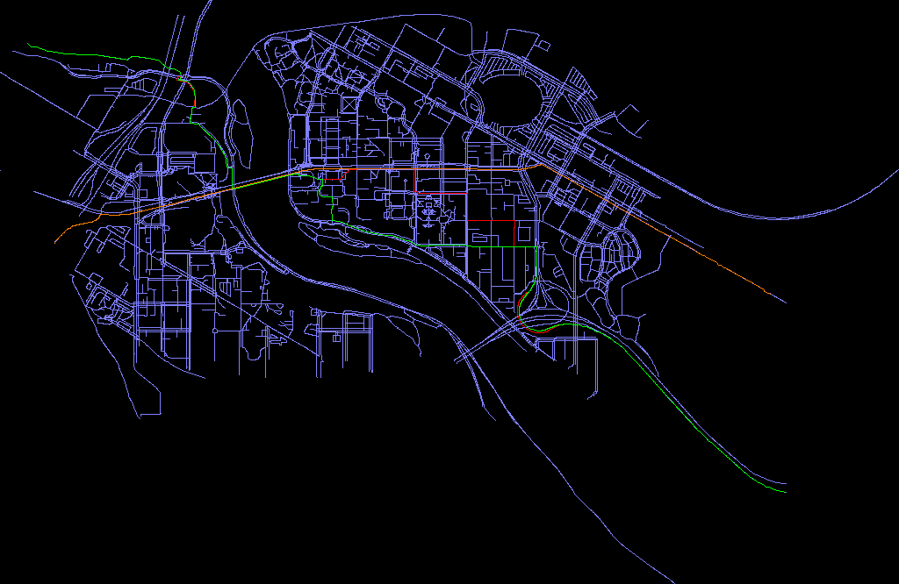

# 3081 Lab05 - Doxygen and Build Automation
_(Due: Thursday, February. 24, 2022 @ 11:59pm)_

## What You Will Learn

1. How to use build automation tool (Make) to compile and produce executable program.
2. How to link external libraries.
3. Basic commands for using Make.
4. How to use Doxygen.
5. How to document your codes professionally.

### Retrieve Class Materials

Navigate to your repository.

```bash
% cd <path_to_directory_repo-userid>
```

Pull down the latest batch of code

```bash
% git pull
```

### What's in labs/lab05_Doxygen_and_Build_Automation

- src
  - Makefile:
    - This makefile is provided to allow you an easy start to configure and build the executables.  You will need to modify this.
  - color.cc/h
  - image.cc/h
  - pathFinding.cc
  - stb_image_write.h
  - stb_image.h
- lib
  - Makefile
    - You do **not need** to edit or modify this.
  - data
    - open street map files. Create your own map [here](https://www.openstreetmap.org/export#map=16/44.9726/-93.2358) to play around if you want to.
  - include
    - header files for the routing library
  - src
    - routing library source code
  
- README.md:
  - You're reading this now.

### What You Will Modify

- src/Makefile:
  - You will update this Makefile to build the pathFinding application in **efficient way**.

### Goal

<hr>
  **The primary goal of this lab is for you to understand how to use build automation tool and Doxygen**
<hr>

# Build Automation

Build automation is the activity of creating and building software automatically. The creation of a software build can include tasks like: compiling source code into binary code, packaging binary code, and running automated tests.
For this class, we will be using the build automation tool called  **Make**.

### Configuring Makefiles

Depending on the system, environment being used, or customized compiler options it is common to configure your makefile based on the specific machine.  For example, we may want to specify the specifically compiler that should be used.  We often use variables to accomplish this as we have seen in lab02.  Notice the top of the Makefile provided:

```
CXX=g++
CXXFLAGS = -std=c++11
ROOT_DIR := $(shell git rev-parse --show-toplevel)
-include $(ROOT_DIR)/config/settings
-include $(DEP_DIR)/env
```

__What does all that mean?__
- `CXX` : The name of the compiler you would like to use
- `CXXFLAGS` : Specific compiler flags that tell how to build the program
- `ROOT_DIR` : The top directory in your repository (found using git)
- `-include $(ROOT_DIR)/config/settings` : Loads repository level configuration variables (look at the file in x500-repo/config/settings).  Notice the settings file includes a path to DEP_DIR, which is useful for finding the path to the dependencies.  This way we only need to put this path in one place.
- `-include $(DEP_DIR)/env` : Loads environment level configuration variables.  ssh into one of the lab machines and see that it sets the compiler to: `CXX=/soft/gcc/7.1.0/Linux_x86_64/bin/g++`.  This will override the default compiler if we use the $(CXX) variable in our commands to build targets (as we will see).  This is what enables us to build on VOLE where the default compiler may be a different version.

Going forward, you will want to put these configuration variables at the top of your Makefiles to enable multiple different environments (CSE Labs Machines, VOLE, SSH, Docker).


### Building Projects with Makefiles

We can add a target for each .o file we created as well as the dependency ([example](https://github.umn.edu/umn-csci-3081-s22/examples/blob/main/labs/lab5/Inefficient%20make%20example/Makefile)). However, this isn't very efficient, especially for large projects. So, we need a shortcut!

The solution is to use wildcards.  Open up the Makefile.  Notice there is an `all` target which builds an applications: pathFinding_app.  Notice how there are no targets for building either application or the object files (*.o).   Make allows us to be flexible by adding the following target with wildcards:

```
%.o: %.cc
	$(CXX) $(CXXFLAGS) $(INCLUDES) -c $^ -o $@
```

Notice we are using the configuration variables defined above. Go ahead and add this to your make file in 'src/Makefile'.

**What's happening here?**

- `%`  : This symbol is the wildcard. It matches to any `<filename>.o` target that you want to make, and it uses that matching filename in the dependency list as well.

- `$^` : is a synonym for the slightly longer shortcut `$(inputs)`, which is just the list of all dependencies listed after the target.
    > e.g. all the `.cc` files listed as dependencies

- `$@` : is a shortcut meaning the name of the target without the .o extension.

Finally, lets add the flexible target for building the applications:

```
%_app: $(OBJFILES)
	$(CXX) $(CXXFLAGS) $(LIBDIRS) $^ $(LIBS) -o $@
```

Go into the src folder to continue...

```
$ cd src
```

Now, let's run `make` to build our applications.

    $ make

Note it builds all the applications. Let's execute them:

Usage: ./pathFinding_app [input graph] [output pic name]

    $ ./pathFinding_app ../lib/routing/data/umn.osm umn.png

Checkout the output path picture inside the src folder.  You should probably see something like this depending on the input file:



- Green line  : A* algorithm (fastest route from Top Left to Bottom Right)
- Orange line : Dijkstra algorithm (fastest route from Middle left to Middle Right)
- Red line    : Depth First Search algorithm (a route from Top left to Bottom Right)

Now, compare the make file with [inefficient makefile](https://github.umn.edu/umn-csci-3081-s22/examples/blob/main/labs/lab5/Inefficient%20make%20example/Makefile) with what you wrote and see the difference.

# Doxygen

How to generate documentation and UML for the code in this project and future projects. This can be done via Doxygen.

According to their [official website](https://www.doxygen.nl/index.html),
> Doxygen is the de facto standard tool for generating documentation from
> annotated C++ sources, but it also supports other popular programming languages
> such as C, Objective-C, C#, PHP, Java, Python, IDL (Corba, Microsoft, and
> UNO/OpenOffice flavors), Fortran, VHDL, Tcl, and to some extent D.

Notice how the class [**some class**] has a description above the
class definition. Doxygen makes use of this to generate documentation for this
class. Doxygen also generates documentation for all functions of a class.

<br>

***NOTE: Students working on their personal machines will have to [download](https://www.doxygen.nl/manual/install.html) the
doxygen executable before continuing. CSE labs machines already have doxygen
installed. Windows .exe can be found here ->[download](https://www.doxygen.nl/files/doxygen-1.9.3-setup.exe)***

<br>

Before you continue, go to the top folder of this lab.

```bash
% cd <path_to_directory_repo-userid>/labs/lab05_doxygen_and_build_automation/
```

1. Create the configuration file.

  To start generating documentation, you must first generate a Doxygen
  configuration file in the docs directory. Run the following command from the
  lab05 directory (where this README is).

  ```
  mkdir docs
  doxygen -g docs/Doxyfile
  ```

  You will now see a new file **Doxyfile** in the <code>docs</code> directory.

2. Modify the Doxyfile to look in the <code>src</code> and <code>lib</code> folder when compiling (i.e, only the folder that was set as an Input will get the examination from doxygen). You can do
   this by setting the **INPUT** tag of your **Doxyfile**. Since this lab required you to write doxygen for only certain files/classes, you would need to point the Input to <code>lib/</code>. It should be around `line 832` within `Doxyfile`.

  ```
  INPUT                  = "../lib/routing/include/"
  ```

  You would also want to set **RECURSIVE** tag of your **Doxyfile** to YES so that all the codes inside the folder you set for the input will be taken account for. Locate to `line 911` within `Doxyfile`.

  ````
  RECURSIVE              = YES
  ````
  
  Now, set the **EXCLUDE** tag to parsers and util folder. This tag is used if you do not want the doxygen to look at the provided path folders. You can find the EXCLUDE tag around `line 920`.
  ````
  EXCLUDE                  = "../lib/routing/include/parsers" "../lib/routing/include/util"
  ````

  The path is relative to the directory from which you run/compile the doxygen. ***It is important that you set it up to run from `docs/`***, because that is where the grading scripts will run from. Doxygen will not inform you if it does not find the src directory -- it just won't generate any files from your classes.


3. Generate the html pages for this lab. Run the following commands:
  ```
  cd docs
  doxygen Doxyfile
  ```

  You can now view the generated documentation from the `index.html` file in the
  `html` directory that was generated inside the docs folder. Open the `index.html` page which is refered to as the *landing page*. Explore the various menus to see how the comments in the code are organized in the html. Click on the classes and you will see UML-like diagrams showing the relationship between classes. One missing piece is a general overview of the code, which you want in the landing page. Currently it is blank because there is no `mainpage.h` file in your `<lab5>/src` directory.

4. Create a home page for the project. In your ``src`` directory, create a file
   `mainpage.h` and paste the following in it.

  ```
  /*! \mainpage My Personal Index Page
   *
   * \section intro_sec Introduction
   *
   * This is the introduction.
   *
   */
 ```

  Generate documentation again by running doxygen as you did before (step 3) from the
  docs directory and notice nothing happens.  This is because you must specify the destination of the `mainpage.h` file in your Doxyfile.

 5. Edit the `Doxyfile` by adding the path `"../src/mainpage.h"` to the `INPUT` line.  The input line should look like this after adding your new path

 ```
  INPUT                  = "../lib/routing/include/" "../src/mainpage.h"
 ```
  
 Now, rerun doxygen to see your changed manpage.

 6. Edit the `mainpage.h` file by giving it a title and write a
    sentence for the introduction.

 7. Now modify the `/lib/routing/include/routing/astar.h` file to add Doxygen comments and see how that gets added to the documentation. Follow the commenting style that you see in `mainpage.h`. Use **@brief** to describe the class or function and **@parm** for the take in parameter of the function and **@return** to specify a function's return values if applicable. You can also refer to Doxygen's [manual](https://www.doxygen.nl/manual/docblocks.html) for their commenting standards.

8. Files that you need to document using doxygen:
  - /lib/routing/include/
    - routing/
      - astar.h
      - depth_first_search.h
      - dijkstra.h
    - impl/
      - simple_graph.h
    - bounding_box.h
    - distance_function.h
    - graph_factory.h
    - graph.h
    - routing_api.h
    - routing_strategy.h
 9. You can check out this [example code](https://www.doxygen.nl/manual/docblocks.html), [example2 code](https://github.umn.edu/umn-csci-3081-s22/shared-upstream/blob/main/labs_solution/lab03/vector3.h) and see how the documentation will look like 
    [here](https://www.doxygen.nl/manual/examples/afterdoc/html/class_afterdoc___test.html)
<br>

# Optional
Play around with the pathFinding program by providing your desired bounds node. Create your own map [here](https://www.openstreetmap.org/export#map=16/44.9726/-93.2358).  You can also look at obj triangle meshes like the `../lib/routing/data/teapot.obj`.

## **Submission**

Submit your work by uploading the following files to Canvas for the Lab05 assignment. Your submission will be manually graded and your score recorded.

<ul>
  <li>  Your edited <code>Makefile</code> file
  <li>  <code>Doxyfile</code>
  <li>  All the <code>edited files</code> from the step 8 Doxygen 
</ul>

THIS CHECKPOINT IS COMPLETE.

Congratulations!
