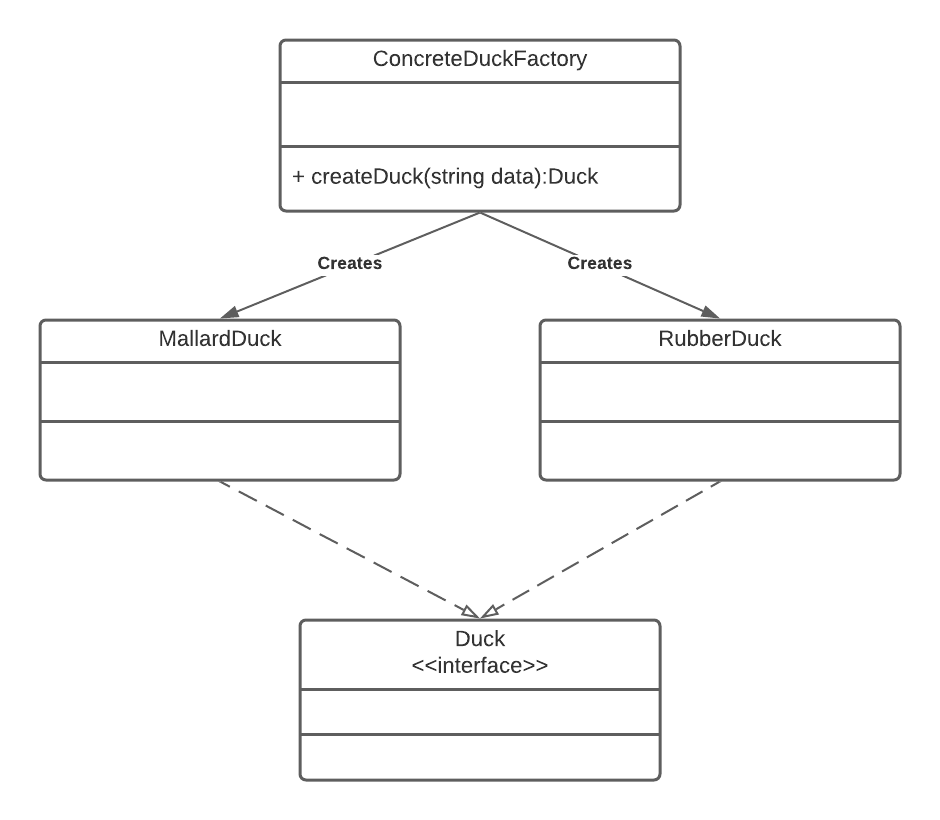
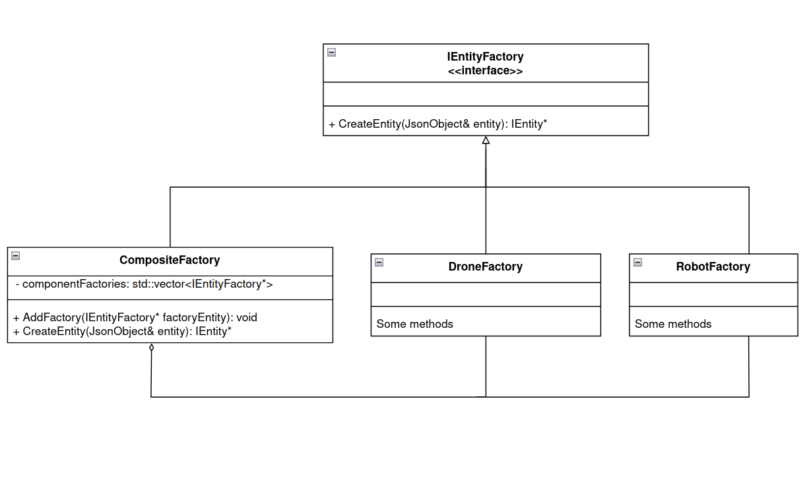

# Lab 06 Composite Factory Lab
_(Due **Thursday**, March 3, 2022 @ 11:59pm)_


## Introduction

This lab will introduce you to two design patterns that are used frequently in software design: The factory pattern and the composite pattern. <br>
In the workshop3, you were implementing the drone and robot to show up but in any pattern/ways. However, for this lab, you will be implementing the composite factory pattern to generate the drone and robot.

## Retrieve Class Materials

Navigate to your repository.

```bash
% cd <path_to_directory_repo-userid>
```

Pull down the latest batch of code

```bash
% git pull
```

### The Factory Pattern

The factory pattern defines an interface for creating an object, but lets the subclasses decide which class to instantiate. Factory method lets a class defer instantiation to subclasses. Utilizing the factory pattern allows you, the developer, to enforce SOLID principles.

There are two types of factories that you can create: An abstract factory or a concrete factory. 

#### Generic Concrete Factory UML

Below is the UML to create concrete factories. This pattern should be used when the number of items to generate will rarely change in your software development. For example, in our simulation if we were only going to generate drones, packages, and customers then the concrete factory should be used. Since we are not limiting ourselves to these entities, the concrete factory should not be used.

<p align="center"></p>

#### Generic Abstract Factory UML

Below is the UML to create an abstract factories. This pattern should be used when you want to push the creation of objects into the subclasses. Adding an intermediary class between the factory and your program allows you to utilize polymorphism as shown during lecture and also on the lecture slides.

<p align="center">  </p>

### The Composite Pattern

The composite pattern allows us to treat a group of objects as a single object. Additionally, it allows us to organize those objects as a hierarchy. 

In the composite pattern Component objects will be added to a Composite object (which implemenents the Component interface).

This can be helpful when there are operations that we want to perform on a group of the same type of objects. We would only need to perform the operation on the composite object for the same result as performing that operation on all the composed Component objects. 

<p align="center">  </p>

More information on the composite pattern can be found here: https://www.dofactory.com/net/composite-design-pattern

### Implementing the Composite Factory

For our project, we want to create a composite factory which draws from both the composite and factory patterns. This means that we will have a composite factory which contains different component factories. 

<p align="center">  </p>

Based on the UML, we can see that we will need to be able to add the new types of factories to the Composite factory and then use those added factories to create the entities. 

#### AddFactory
This should add the correct component (i.e. entity) factory to a list of factories(use std::vector) that the Composite factory holds. Consider where this function should be called in your code based on where you need the factories. 

#### Overloading the CreateEntity function
The CreateEntity function will need to be overridden as the CreateEntity function of the base IEntityFactory class is a pure virtual function. The function should loop through each of the factories until the correct factory successfully creates and returns a new Entity based on the parameters. If this process is not clear, refer to the image and link above in the composite pattern section of this document for hints.  

Notice that this CreateEntity function solves our problem of needing to add an 'if' statement to determine which factory needs to be called based on the type of entity as described in the lecture over the Composite Factory Pattern. We just need to call the composite factory's CreateEntity function once. 

# Where to work?

Locate to the project folder at the root folder instead of the lab6 folder. Starting from this lab, you will be most likely to work and modify the codes inside this folder rather than the own labs folder. The individual lab folders will be provided to give instruction on what to do such as current lab6 folder. 

```bash
% <make_sure_you_are_inside_the_root_folder(directory_repo)>
```

locate to the project base code folder
```bash
% cd project
```
You will be working inside this folder

# How to run the project?

If you attend the workshop3, I bet you that you already know how to run the code. However, for those who either doesn't know or foget on how to run it, the following commands will show you how to run the virsualization.

````bash
# Locate to the project base code folder first.
# Clean the project
% make clean

# Build the project
% make -j

# Run the project (./build/web-app <port> <web folder>)
% ./build/bin/transit_service 8081 apps/transit_service/web/
````
Navigate to http://127.0.0.1:8081 and you should see a visualization. <br>
Navigate to http://127.0.0.1:8081/schedule.html and you should see a a page to schedule the trips.
To view the entities, click on the right top of the visualization page (not the schedule page) and choose the entity to view such as drone or (robot name) that you give in the schedule page.

# What to do?
For this lab, you will be refactoring the project code to implement the **Composite Factory pattern** that you seen above.

- Create IEntityFactory class, DroneFactory class ,RobotFactory class and CompositeFactory class where these classes will be use to create the entities.
- CompositeFactory will be mainly used to called the drone and robot factory to **create** the entities.
- DroneFactory will create drones entity if the given entity type is "drone".
- RobotFactory will create robots entity if the given entity type is "robot".
- You would need to change the simulation_model class so that it will not create the drone or robot by itself but rather pass through the **composite factory** with the entity's information, but NOT to the **droneFactory or robotFactory** with the entity's data to decide which type of entity should it be created.

**Hint**: *Use the UML diagram provided for composite factory to get started.*

**Notice:**: the header files must be inside the include folder while the .cc files must be inside the src folder to achieve cleaner file structure.

Finally, you will have the following new files in your project folder:
- CompositeFactory.cc 
- CompositeFactory.h
- DroneFactory.cc
- DroneFactory.h
- RobotFactory.cc
- RobotFactory.h
- simulation_model.cc (Refactored)
- simulation_model.h (Refactored)
- IEntityFactory.h

After you completed implementing the composite factory pattern as well as refactoring the simulation_model class, then you would need to run the project and see whether it produce the drone as well as robot the same way as initially (workshop 3).

# Submission
Show the your section TAs your final result and get checkoff for this lab.

_(Due **Thursday**, March 3, 2022 @ 11:59pm)
